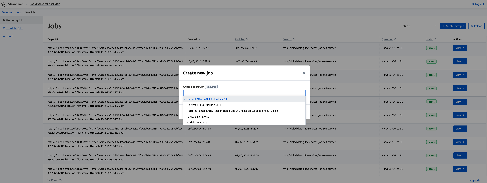

# DECIDe

This repository contains all configuration to get the DECIDe microservices stack running. It is very much a work in progress. Documentation for each use case is provided below.

## What's included?

This repository contains multiple docker-compose files

- _docker-compose.yml_ provides the backend components included through separate configuration files:
  - _compose/base-compose.yml_ provides the base services of a semantic.works app along with (very) common additional services.
  - _compose/data-space.yml_ provides services services relevant for the app operating in a larger data space.
  - _compose/pipeline.yml_ provides the services that govern the data harvesting and processing pipelines. Specific pipelines are further configured in separate files:
    - _compose/oparl.yml_ provides services specific to harvesting data from OParl endpoints.
    - _compose/oslo.yml_ provides services specific to harvesting data for Flemish local authorities.
    - _compose/ai.yml_ provides AI-based services that are used to enrich the arvested data.
  - _compose/validation.yml_ provides services for the human validation of the AI generated annotations.
  - _compose/policy-impact-report.yml_ provides services for generating and showing policy impact reports.
  - _compose/search.yml_ provides most services for smart searching through decisions.
  - _compose/reporting.yml_ provides a service to (periodically) generate reports on the data in the app.
- _docker-compose.dev.yml_ provides small changes for development purposes.
  - Publishes the entrypoint to the services on port 80, so all endpoints can be reached easily.

## Running

The following sections describe how the setup the app as a whole in a development environment. If your are also interested in setting the app up on a server you can find more information in the additional [documentation](./docs/README.md)

### Getting started

1. Clone the repository and go into the directory
2. To ease all typing for `docker compose` commands create a compose override file in the root of the project

```bash
touch docker-compose.override.yml
```

3. Create an env file so we can define the compose files and other environment variables

```bash
touch .env
```

4. Set the `COMPOSE_FILE` in the .env

```bash
COMPOSE_FILE=docker-compose.yml:docker-compose.dev.yml:docker-compose.override.yml
```

### Running the stack

This should be your go-to way of starting the stack.

```bash
docker compose up -d # run without -d flag when you don't want to run it in the background
```

### Running on mac silicon

Running the application on mac silicon can cause some troubles. For this reason an extra docker-compose file has been included, this is the file docker-compose.mac.yml, this file should be included when starting the stack. The command `docker-compose up -f docker-compose.yml -f docker-compose.dev.yml up -d` now becomes `docker compose -f docker-compose.yml -f docker-compose.dev.yml -f docker-compose.mac.yml up -d`
There are two main pain points:

1. Mac has an arm64 processor, a lot of the services don't have a multi-platform image. In the case they only have a amd64 image, docker will gave you a warning about this. In general this is not a real problem since your macbook can just emulate amd64, but still the warnings are annoying, so these are suppressed.
2. At the moment this project was setup the service mu-identifier weren't working for mac (at least on my device), so you have to build these yourself, and gave them the appropriate image name and tag.

### Running the stack with smart search/question-answering

To get the stack to work properly, including its AI question-answering service, there are a few extra steps that need to be done.

First, add your LLM of choice (e.g., `gemma3:1b`) to your `docker-compose.override.yml`:

```yaml
question-answering:
  image: semanticai/decide-question-answering:latest
  environment:
    SEARCH_API_URL: 'http://search:80/expressions/large-search'
    EMBEDDING_API_URL: 'http://embedding:80/embed'
    MU_SPARQL_ENDPOINT: 'http://database:8890/sparql'
    MU_SPARQL_TIMEOUT: '30'
    GENERATION_PROVIDER: 'ollama'
    GENERATION_ENDPOINT: 'http://ollama:11434'
    GENERATION_MODEL: 'gemma3:1b'
    GENERATION_TIMEOUT: '300.0'
    MAX_CONTENT_CHARS: '1000'
    REQUEST_TIMEOUT: '60.0'
    ALLOW_MU_AUTH_SUDO: 'true'
```

To include (smart) search features, the stack needs to be started with the `search` profile: `docker compose --profile=search up -d`.

However, to avoid issues of started services waiting for the database and/or elasticsearch, it is advisable to start the stack in a 'staggered' manner:

```bash
docker compose --profile=search up -d virtuoso migrations
docker compose --profile=search up -d database identifier dispatcher resource
docker compose --profile=search up -d search elasticsearch
```

After `search` has started, inspect the logs to ensure it is not indexing, for example when you are using an existing dataset: `docker compose logs -f search`.

When everything is up, you can start the `ollama` service and manually pull the appropriate model:

```bash
docker compose --profile=search up -d ollama
docker compose exec -T ollama ollama pull mistral-nemo
```

Afterwards, you can start the `embedding` service and ensure it runs error-free. Note, this may take a long time at first as the service will calculate embeddings for all configured targets that do not have an embedding yet. If necessary, consult the `embedding` service [README](https://github.com/semantic-ai/embedding-service/blob/master/README.md#L5) for more details on its configuration.

```bash
docker compose --profile=search up -d embedding
docker compose logs -f embedding
```

Finally, you can start the remaining services of the stack:

```bash
docker compose --profile-search up -d
```

The frontend for the Smart Search should now be available at http://smart-search.localhost .

#### Using different LLM models

By default, the underlying AI [question-answering service](https://github.com/semantic-ai/decide-question-answering) service uses the `mistral-nemo` LLM, locally via the ollama service. If you want to change the used model, some additional setup steps are required:

First, specify your LLM of choice (e.g., `gemma3:1b`) to your `docker-compose.override.yml`:

```yaml
question-answering:
  environment:
    GENERATION_MODEL: 'gemma3:1b'
```

Second, tell the `ollama` service to pull the configured model:

```bash
docker compose exec -T ollama ollama pull gemma3:1b
```

Third, restart the `question-answering` service:

```
docker compose --profile=search up -d question-answering
```

### Using an external LLM provider

See the question-answer service documentation of configuring [LLM providers](https://github.com/semantic-ai/decide-question-answering/blob/master/README.md#L18).

## Use cases

The DECIDe project is designed to address a set of pre-defined use cases. This README outlines each service individually, allowing cities to select and deploy only the specific components required for their unique needs.

The services defined in the `compose/base-compose.yml` file are the core _Semantic.Works_ services required for running the project. In addition to the core service, we also need the generic pipeline components to run the pipelines. To configure the dashboard for your pipelines, see [below](##configuring-the-dashboard).

In DECIDe, four use cases are defined. The first use case (0.0) is about converting and publishing decisions with Linked Data standards so these can be reused interoperable in the data space. The three other use cases (0.1, 1, and 2) are AI-enabled services to enrich the decisions with related things, such as policies, themes, and locations.

### Use Case 0.0: Building up the Data Space

This use case retrieves decisions from a data source, and maps the decisions to the European Legislation Identifier (ELI) standard. Because the input data sources are heterogeneous a specific conversion pipeline is defined for each city.

> [!IMPORTANT]
> Be sure to add a folder "[nel](https://github.com/lblod/app-decide/blob/7f9bc93afb2ff1c3bb009a51ff6a88f2b2b73c41/compose/ai.yml#L31)" to your local data folder containing the [queries/local folder](https://github.com/semantic-ai/entity-linking-backend/tree/master/data/queries/local) and [endpoints_metadata.json file](https://github.com/semantic-ai/entity-linking-backend/blob/master/data/endpoints_metadata.json) from the [entity-linking service](https://github.com/semantic-ai/entity-linking-backend).

#### Background

The data retrieval and processing is organised as several pipelines each one doing a specific job. Each job in turn consists of one or tasks where each task is performed by a single service. The [job-controler-service](https://github.com/lblod/job-controller-service) is the central service responsible for creating appropriate tasks at the right time based on its configuration.

In summary, the `job-controller` service monitors for the creation of jobs as well as status changes for the tasks it creates. For example when a user creates a new data retrieval job via the pipeline dashboard, the `job-controller` will see this new job and create the first task configured for that kind of job as well as mark the job as "busy" to indicate it is in progress. Another service is then responsible for picking up the created task and marking it as completed, either successful or with a failure, when it has performed the appropriate actions. The `job-controller` monitors for such task status changes and will react to it by creating a subsequent task whenever one is successfully completed. When all tasks within a job are marked as successful the `job-controller` will mark the job as a whole as "success" to indicate it is done. If a service marks a task as "failed", the `job-controller` will not created subsequent tasks and mark the job as a whole also "failed".

For more extensive background information see the [write up](https://app.gitbook.com/o/-MP9Yduzf5xu7wIebqPG/s/PzeOtGh2pfnNKyqa7G5w/decide-project/write-up-uc0.0-dataspace/write-up-uc0.0-pipelines) concerning pipelines or the README files for involved services such as the `job-controller`.

#### OSLO (Ghent)

The OSLO to ELI pipeline consists of three task-driven services. The [harvester-consumer-service](https://github.com/lblod/decide-harvester-consumer-service) ingests data from the remote LBLOD harvester into a landing graph, downloading a full dump for initial syncs or delta files for subsequent runs. The [harvester-filter-service](https://github.com/lblod/decide-harvester-filter-service) then filters the landing graph by RDF type and a configured whitelist of bestuursorganen, writing matched subjects to a result graph. Finally, the [harvester-transformation-service](https://github.com/lblod/decide-harvester-transformation-service) reads that result graph and transforms the OSLO besluiten into ELI triples stored in the output graph.

To start the pipeline, create a "Harvest Lokaal Beslist OSLO & Publish as ELI" job in the pipeline dashboard and select a "Sync mode": choose "Initial sync" to download the full dataset (run once) or "Delta sync" to ingest incremental updates (suited for a recurring scheduled job). See `docker-compose.yml` for the service configuration.

> [!NOTE]
> The OSLO pipeline ingests all data from the LBLOD harvester, which includes more data than strictly necessary. See [OSLO_PRUNING.md](./OSLO_PRUNING.md) for guidance on reducing the database size after the initial sync.

#### OParl (Freiburg)

The OParl to ELI pipeline consists of multiple services. The main service is the [oparl-to-eli](https://github.com/lblod/oparl-to-eli-service) service, which scrapes all pages from an OParl API, transforms them to [ELI](https://eur-lex.europa.eu/eli-register/about.html) data, and writes to files for further processing.
Next, the [harvest_singleton-job](https://github.com/lblod/harvesting-singleton-job-service) service is used to prevent overlapping harvest rounds. The [harvest_sameas](https://github.com/lblod/import-with-sameas-service) service is used for two things: adding a local identifier (UUID) to each OParl entity, and importing the data in the triple store. The [harvest_diff](https://github.com/lblod/harvesting-diff-service) generates which triples are deleted, or added to make sure the triple store is in sync with the OParl source.

To start the OParl pipeline, create a "Harvest OParl API & Publish as ELI" job in the pipeline dashboard. Only an "URL" parameter is required. This can be the root OParl URL (`https://ris.freiburg.de/oparl`), or a more specific OParl URL (`https://ris.freiburg.de/oparl/Body/FR/paper`).

#### PDF (Bamberg)

The PDF to ELI pipeline allows to gather PDFs containing decisions from the web and transform them the linked data following the [ELI](https://eur-lex.europa.eu/eli-register/about.html) standard. This pipeline consists of three main services:

1. The [harvest_singleton-job](https://github.com/lblod/harvesting-singleton-job-service) service ensures that no duplicate jobs are created for the same data sources. When a new job is created, it checks whether one is already scheduled or busy for the same data sources. If so, the new job is automatically failed.
2. The [pdf-scraper](https://github.com/semantic-ai/decide-pdf-scraper) service gathers the download URLs for new PDF files and stores these URLs in the triple store.
3. The [pdf-content](https://github.com/semantic-ai/decide-pdf-content-extraction) service reads a remote or local PDF file, extracts the content of the PDF, and creates corresponding ELI entities (Work/Expression/Manifestation) in the triple store. This `pdf-content` services depends on the [apache-tika](https://github.com/lblod/apache-tika-service) service to extract text from a PDF.

In the pipeline dashboard, the "_Harvest PDFs from Website URL & Publish as ELI_" job is used to harvest PDFs from some locations and convert them to linked data following ELI.

> [!WARNING]
> Currently, this PDF to ELI pipeline also automatically performs tasks to translate, segment and link entities to the created ELI data. This will be split into two separate pipelines in a future version.

### Use Case 0.1: Linking to higher legislation or overarching goals such as the SDGs

In the pipeline dashboard, create a "Codelist mapping" pipeline. First, the `Codelist` parameter needs to be filled in with the URI of a SKOS Concept scheme. For Sustainable Development Goals (SDGs), this is `http://data.lblod.gift/id/conceptscheme/sdg-simple`. Optionally, a `Decisions to map` can be provided to map a specific decision with the codelist. This must be a URI of an ELI Work or Expression.

The [policy impact report frontend](https://github.com/lblod/frontend-decide-policy-impact-report) allows to visualise and assess the annotated data. This frontend relies on the [policy impact report service](https://github.com/lblod/policy-impact-report-service) to retrieve the necessary data.

TODO: add example screenshot(s)

### Use Case 1: Mapping Local Decisions on restricted mobility zones to geo-locations for city portals (mobility and green deal)

This use case enriches decisions with annotations identifying _Restricted Mobility Zones (RMZ)_. In summary, it wil determine whether a decision concerns an RMZ and, if so, which geographical locations are impacted and when. For a more detailed description of this use case and how it was developed within the DECIDe project see the dedicated [gitbook page](https://app.gitbook.com/o/-MP9Yduzf5xu7wIebqPG/s/PzeOtGh2pfnNKyqa7G5w/decide-project/write-up-uc1-restrictive-mobility-zones#datasources-datasets-and-datastandards).

The primary services for this use case are the [codelist-labeling](https://github.com/semantic-ai/codelist-labeling-service) and [Named-entity-recognition](https://github.com/semantic-ai/decide-geocoding-service) services. The former classifies decisions on whether they concern an RMZ. The latter detects and parses the relevant locations and dates mentioned in RMZ-related decisions. Note, the `nominatam` service is use to improve location, make sure this is configured to load the correct data for your country.

To classify decisions with respect to RMZ, use the pipeline dashboard to create a "Codelist mapping" job (as describe in [UC0.1](#use-case-01-linking-to-higher-legislation-or-overarching-goals-such-as-the-sdgs)) using `http://data.lblod.gift/id/conceptscheme/restricted-mobility-zone-simple` as codelist. Afterwards you can enrich the decisions by starting a "Perform Named Entity Recognition & Entity Linking on ELI decisions & Publish" a job. Optionally, specify the URIs of one or more decisions in the `Decisions to map field` if you want to process specific decisions. Otherwise, leave that field empty and provide a graph in `Decisions graph` field to process all decision resources in that graph.

The [human validation frontend](https://github.com/lblod/frontend-decide-human-validator) illustrates how the enriched could be visualised. The "Validate codelist mapping" route allows to inspect decisions related to RMZ when you select the appropriate codelist as concept scheme. The "Validate text annotations" route allows to inspect decisions that were annotated with, amongst other entities, locations and dates.

### Use Case 2: Smart Search

This use case provides smart, LLM-powered search functionality for the decisions in the app. The [smart-search](https://github.com/lblod/frontend-decide-question-answering) frontend allows users to enter their questions. The [question-answering](https://github.com/semantic-ai/decide-question-answering) service orchestrates the subsequent request flow between the involved backend services. The [embedding](https://github.com/semantic-ai/embedding-service) service creates an embedding of the user's question. The [mu-search](https://github.com/mu-semtech/mu-search) and [elasticsearch](https://github.com/mu-semtech/mu-search-elastic-backend) services are used to find the most relevant decisions based on a vector similarity search. Finally, the `question-answering` service asks the configured LLM to formulate an answer to the user's question based on the contents of the found decisions.

For a more detailed description of this use case and how it was developed within the DECIDe project see the dedicated [gitbook page](https://app.gitbook.com/o/-MP9Yduzf5xu7wIebqPG/s/PzeOtGh2pfnNKyqa7G5w/decide-project/write-up-uc2-smart-search).

For more information on configuring an app instance to support smart search see the [above configuration section](#running-the-stack-with-smart-searchquestion-answering).

## Pipeline dashboard

### Jobs

There are two types of jobs: harvesting and scheduled. The harvesting job is a one-time run of a job, while the scheduled job is triggered periodically following a cron pattern.

By pressing "Create new job", a job type ("operation") can be selected to create a new job.



## Frontends

### Accessing the frontends from your local machine

We use dispatcher v2, which dispatches different frontends based on hostname. If this does not work out of the box, you may have to add an entry similar to the following to your `/etc/hosts`:

```
127.0.0.1 dashboard.localhost
127.0.0.1 ds.localhost
127.0.0.1 human-validator.localhost
127.0.0.1 yasgui.localhost
127.0.0.1 policy-impact-report.localhost
```

# Sources for rdfs:comments

The rdfs:comments for eli and eli-dl were sourced from http://data.europa.eu/eli/eli-draft-legislation-ontology# and http://data.europa.eu/eli/ontology#. rdfs:comments from migration `config/migrations/20260612060322-add-other-rdfs-comments.sparql` were added based on the content retrieved from the uris themselves, if they weren't dereferenceable, we created our own rdfs:comment.
