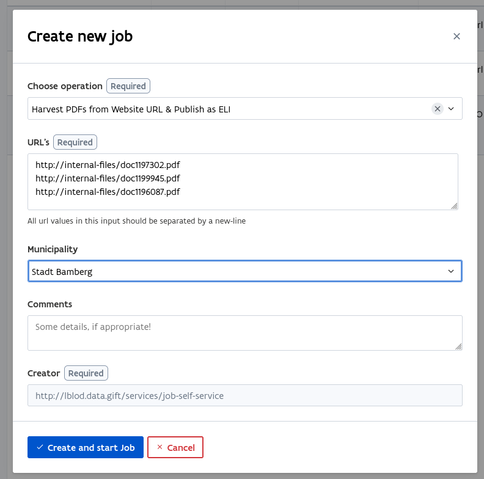

# Additional documentation

This folder contains additional documentation, primarily aimed at configuring and setting up the application to support only a subset of the use cases.


## Server setup
### Requirements
#### Hardware
To run the full app a sufficiently powerful server is advised. A GPU is only required if you want to locally run the LLM-based functionality. Otherwise, the relevant services should be configured to outsource such functionality to cloud services.

Our server has the following specifications:

- CPU: 13th Gen Intel(R) Core(TM) i5-13500
- GPU: NVIDIA RTX 4000 SFF Ada Generation
- Memory: 64GB
- Storage: 2TB

#### Software
This application is a [semantic.works](https://semantic.works/) app and thereby has limited dependencies. The following software is required to run the application:

- `git` to obtain the application source code
- `docker` and `docker compose` to configure and run the application's microservices
- A reverse proxy that forwards HTTP requests to the app's identifier service. We typically use [app-letsencrypt](https://github.com/redpencilio/app-letsencrypt) for this purpose.

### Updating the app
Generally updating (parts of) the app consists of pulling the latest version from the remote repository via a  `git pull` and, recreating and/or restarting the appropriate services.
For each service `A` that was added or updated (version bump or changed environment variables), do `docker compose up [-d] A`. For each service `B` for which their configuration was updated in the `../config/B` folder, do a `docker compose restart B`. Note, that `up` on its own does **not** cause a service to update its configuration.


## Service configuration
Most of the services in this app are configured via the docker compose configurations files and appropriate configuration files in the `config` folder in this project. Note, the [gitbook page](https://app.gitbook.com/o/-MP9Yduzf5xu7wIebqPG/s/PzeOtGh2pfnNKyqa7G5w/decide-project/write-up-uc0.0-dataspace) on UC0.0 contains background on the overal architecture of a semantic.works application.


### Identifier
The `identifier` service is an HTTP proxy that acts as access point to the app. All external requests should be forwarded to this service for further processing in an app. On servers we typically use [app-letsencrypt](https://github.com/redpencilio/app-letsencrypt) as a reverse proxy to forward incoming requests the the correct app instance. To allow `app-letsencrypt` to forward requests to the correct app, the app's `identifier` service should

- expose the appropriate environment variables; and
- be part of of `app-letsencrypt`'s default network.

This is most easily done in the app's `docker-compose.override.yml` configuration file. For example, the DECIDe app instance hosted by ABB has the following configuration entries:

```yaml
services:
  identifier:
    environment:
      VIRTUAL_HOST: "ds.decide.lblod.info,dashboard.decide.lblod.info,yasgui.decide.lblod.info,human-validator.decide.lblod.info"
      LETSENCRYPT_HOST: "ds.decide.lblod.info,dashboard.decide.lblod.info,yasgui.decide.lblod.info,human-validator.decide.lblod.info"
      LETSENCRYPT_EMAIL: "support+servers@redpencil.io"
  # Configuration for other services
  # ...

networks:
  proxy:
    name: letsencrypt_default
    external: true
```

The example docker compose override files in this folder contain commented template entries that can be used for your app.


### Subdomains used for different frontends
This app contains several frontends to which the `dispatcher` service forwards requests based on subdomains. This can be seen in the `dispatcher` service [configuration](../config/dispatcher/dispatcher.ex) in rules using `reverse_host` to match incoming requests. Should you use different subdomains in you app instance, make sure to update the appropriate rules in your app's dispatcher configuration.

| Frontend                                                                                                      | Subdomain              |
|---------------------------------------------------------------------------------------------------------------|------------------------|
| [Pipeline dashboard](https://github.com/lblod/frontend-harvesting-self-service/tree/feature/oparl-harvesting) | `dashboard`            |
| [Yasgui](https://github.com/lblod/frontend-decide-yasgui)                                                     | `yasgui`               |
| [dcat](https://github.com/lblod/frontend-decide-dcat)                                                         | `ds`                   |
| [Human Validation Tool](https://github.com/lblod/frontend-decide-human-validator)                             | `human-validator`      |
| [Smart search](https://github.com/lblod/frontend-decide-question-answering)                                   | 'smart-search'         |
| [Policy impact report](https://github.com/lblod/frontend-decide-policy-impact-report)                         | `policy-impact-report` |


### Outsource LLM to the cloud
The AI services relying on LLMs by default use local models. But they can also be configured to outsource such computations to external services in the cloud. The READMEs for each individual service describe in more detail how to configure them as such. Note that this requires obtaining appropriate API keys for each service.

- The  [named-entity-recognition (NER)](https://github.com/semantic-ai/decide-geocoding-service/blob/master/README.md#L39) service allows to configure providers for several of its features.
- The [entity-linking-backend](https://github.com/semantic-ai/entity-linking-backend/blob/master/README.md) service README documents how to configure external providers.
- The [codelist-labeling](https://github.com/semantic-ai/codelist-labeling-service/blob/master/README.md) service can be configured to use a mistral as external provider. Using another external provider requires adding the appropriate `langchain-*` package to the service by editing its `requirements.txt` file and building your own image.
- The [Question-answering](https://github.com/semantic-ai/decide-question-answering/blob/master/README.md) service can be configured to use different providers. This does require adding the appropriate `langchain-*` package to the service by editing its `requirements.txt` file and building your own image.
- The [Embedding](https://github.com/semantic-ai/embedding-service/blob/master/README.md) service currently does not **not** support using an external provider. Embeddings can generated locally without a GPU, but this will take considerable longer.


### Login for pipeline dashboard
The app is configured with a [default account](../config/migrations/add-test-user/20251211000000-add-test-user.sparql) with username `test` for the pipeline dashboard. Accounts are managed by inserting and/or updating triples in the triplestore, typically using [migrations](https://github.com/mu-semtech/mu-migrations-service). The creation of migrations can be simplified using [mu-cli](https://github.com/mu-semtech/mu-cli).

#### Adding a new account
Creating a new requires adding a migration similar to the already existing [account](../config/migrations/add-test-user/20251211000000-add-test-user.sparql). The [registration](https://github.com/mu-semtech/registration-service) service provides a mu-cli script to easily generate such a migration.

- Ensure [mu-cli](https://github.com/mu-semtech/mu-cli) is installed
- Uncomment the entry for the `registration` service in the appropriate override file and start the service: `docker compose up registration`
- Execute the script to generate a migration using mu-cli: `mu script registration generate-account --name NAME --account USERNAME --password PASSWORD`. This creates a migration in `config/migrations/TIMESTAMP-create-user-USERNAME.sparql`
- Restart `migrations` service to execute generated migration: `docker compose restart migrations`
- Stop the `registration` service and re-comment entry

#### Disabling existing accounts
To disable an account its status can be changed to inactive via another migration. First, generate a new migration file using the script provided by the `migrations` service, the following command will create file `config/migrations/TIMESTAMP-NAME.sparql`:

```bash
mu script migrations new sparql NAME
```

Second, the query below deactivates a given account. Copy this query into the generated migration file and replace `ACCOUNT_UUID` by the UUID of the `OnlineAccount` resource. This UUID can be found in the migration that initially added the account. For example, to disable the [default account](../config/migrations/add-test-user/20251211000000-add-test-user.sparql) the replacement for `ACCOUNT_UUID` would be `d011deb8-64b8-4497-81df-e32ff19cbdc5`.

```sparql
PREFIX account: <http://mu.semte.ch/vocabularies/account/>
PREFIX accounts: <http://ext.data.gift/accounts/>

DELETE {
  GRAPH <http://mu.semte.ch/graphs/users> {
    ?account account:status ?currentStatus .
  }
} INSERT {
  GRAPH <http://mu.semte.ch/graphs/users> {
    ?account account:status <http://mu.semte.ch/vocabularies/account/status/inactive> .
  }
} WHERE {
  GRAPH <http://mu.semte.ch/graphs/users> {
    VALUES ?account {
      accounts:ACCOUNT_UUID
    }
    ?account a foaf:OnlineAccount ;
             account:status ?currentStatus .
  }
}
```

Finally, restart the `migrations` service to execute the created migration.

```bash
docker compose restart migrations; docker compose logs -f migrations
```


### Verifiable credentials
- TODO VC configuration


## Partner configurations
This folder also contains some pre-configured docker compose configurations disabling services that are unnecessary for the use cases specific partners are interested in. The easiest way to include this configurations is to add them as last entry in your `.env` file:

```bash
COMPOSE_FILE=docker-compose.yml:docker-compose.override.yml:./docs/docker-compose.override.NAME.yml
```

Note, take care **not** to include the `docker-compose.dev.yml` file here as this can expose services to the outside world.


### Bamberg
The city of Bamberg is mostly interested in use case 0.1 and 2. Therefore their [partner-specific configuration](./docker-compose.override.bamberg.yml) disables unnecessary services as well as provide some placeholders for configuring specific services. See the comments in the override file for more information.

#### Data harvesting
Due to technical limitations our `pdf-scraper` service cannot directly retrieve PDFs from the [web portal](https://www.stadt.bamberg.de/buergerinformationssystem/tr010) of the city of Bamberg. A workaround is to obtain the PDFs via another method and feed them into the app from disk using an additional service.

To this end, an `internal-files` service is configured in `docker-compose.override.bamberg.yml`. This service mounts a folder `data/internal-files`, make sure to create this folder, in which PDFs can be placed.

In the pipeline dashboard you can use `http://internal-files/FILENAME.pdf` as input decision URLs. As municipality select `Stadt Bamberg` from the options in the dropdown, as illustrated in the following screenshot.




### Freiburg
TODO


### Ghent
TODO
